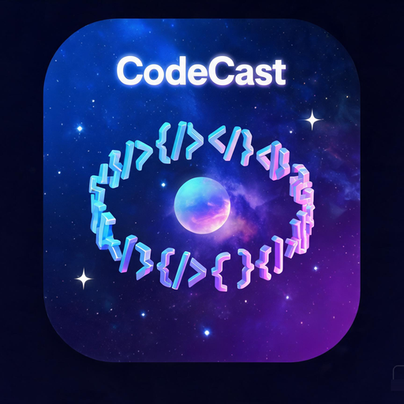

<p align="center">
  
</p>

# CodeCast

<p align="center">
  <a href="https://codecast.cloud"></a>
  <a href="https://github.com/1405451216/CodeCast/releases"></a>
  <a href="https://github.com/1405451216/CodeCast/blob/main/LICENSE"></a>
  <a href="https://github.com/1405451216/CodeCast"></a>
</p>

**AI 驱动的智能编程助手 —— 只需提出想法，执行交给 AI。**

CodeCast 是一款本地优先的跨平台桌面应用，内置情景记忆系统、项目管理、Git 集成和技能扩展。它不只是一个聊天窗口——它理解你的项目上下文，记住你的偏好，帮你从想法到产物一步到位。自带 DeepSeek API Key 即可使用，数据完全本地存储，隐私安全。

<table>
<tr><td><b>🧠 情景记忆</b></td><td>基于 SQLite FTS5 的全文检索记忆系统。AI 能记住历史对话、自动提取摘要和标签，在新对话中召回相关上下文——跨会话的连续性体验。</td></tr>
<tr><td><b>📁 项目感知</b></td><td>多项目工作区管理，文件浏览/读写/预览，沙箱安全校验。AI 理解你的项目结构，在正确的上下文中工作。</td></tr>
<tr><td><b>🔧 技能系统</b></td><td>内置代码生成、代码审查、文档生成等技能。支持自定义技能创建和 JSON 导入，按需扩展 AI 能力边界。</td></tr>
<tr><td><b>🔌 MCP 协议</b></td><td>支持 WebSocket 和 stdio 两种 MCP 服务器接入，内置 Chrome DevTools 集成。连接任意 MCP 服务器扩展工具链。</td></tr>
<tr><td><b>⚡ Git 集成</b></td><td>实时 Git 状态检测，AI 修改文件后自动 commit，智能生成 commit message。开发工作流无缝衔接。</td></tr>
<tr><td><b>⏰ 自动化调度</b></td><td>内置定时任务系统，支持 hourly/daily/自定义 cron 表达式。代码审查、日报生成、定期备份——无人值守运行。</td></tr>
<tr><td><b>🖥️ 终端执行</b></td><td>沙箱化 Shell 命令执行，危险命令拦截，超时控制。AI 不只能写代码，还能帮你运行和调试。</td></tr>
<tr><td><b>🔒 本地优先</b></td><td>代码和数据完全本地存储，API Key AES-256-GCM 加密，路径沙箱防穿越，文件大小限制。你的代码只属于你。</td></tr>
</table>

---

## 快速开始

### 下载安装

前往 [codecast.cloud](https://codecast.cloud) 或 [GitHub Releases](https://github.com/1405451216/CodeCast/releases) 下载：

| 平台 | 文件 | 说明 |
|------|------|------|
| Windows | `CodeCast.exe` | Windows 10+ x64 |
| macOS (Apple Silicon) | `CodeCast-macOS-arm64.dmg` | M1/M2/M3/M4 芯片 |
| macOS (Intel) | `CodeCast-macOS-amd64.dmg` | Intel 芯片 |
| Linux | 即将推出 | — |

### 配置

1. 启动 CodeCast
2. 进入设置，填入你的 DeepSeek API Key
3. 选择模型（deepseek-v4-flash 快速响应 / deepseek-v4-pro 深度推理）
4. 开始对话！

---

## 核心功能

### AI 对话

CodeCast 提供多会话管理，支持创建、切换、归档对话。你可以选择不同的 AI 人格风格（友好/专业/简洁/详细），设置自定义指令注入 System Prompt，开启深度思考模式进行复杂推理，以及使用长上下文模式（1M token 窗口）处理大型代码库。

### 情景记忆系统

这是 CodeCast 最独特的能力。基于 SQLite FTS5 全文检索引擎，AI 会自动为每次对话生成摘要和标签，在新对话开始时检索相关历史记忆注入上下文。你不需要反复解释项目背景——AI 记得你之前说过什么、做过什么。记忆支持 30 天自动清理，后台异步处理不影响对话流畅度。

### 项目管理

支持多项目工作区切换，内置文件浏览器可以查看、读取、编辑项目文件。所有文件操作都经过沙箱安全校验，防止目录穿越攻击。文件预览面板支持代码高亮，2MB 大小限制保证渲染性能。也支持"无项目模式"进行纯对话。

### 技能与扩展

内置技能覆盖常见开发场景：代码生成、代码审查、文档生成。你也可以创建自定义技能，定义专属的 Prompt 模板，通过 JSON 导入分享给团队。技能的 Prompt 具有最高优先级，精确控制 AI 行为。

### MCP 协议集成

通过 Model Context Protocol 连接外部工具服务器，支持 WebSocket 和 stdio 两种传输方式。内置 Chrome DevTools MCP 服务器，可以直接在对话中操控浏览器。支持服务器连接测试、启用/禁用管理。

### Git 工作流

自动检测项目 Git 状态（当前分支、是否有未提交更改、ahead/behind 状态）。AI 修改文件后可以自动执行 git add + commit，智能生成 commit message，提交前通过对话框确认。

### 自动化任务

创建定时任务，支持多种调度表达式（every 30m / hourly / daily / daily 09:00）。后台调度器每分钟检查一次，任务完成后通知前端。适合定期代码审查、日报生成、自动备份等场景。

### 终端与命令执行

在项目目录内执行 Shell 命令，自动适配平台（Windows PowerShell / macOS zsh / Linux bash）。内置危险命令拦截（rm -rf /、format 等），超时控制防止命令挂起，支持自定义环境变量注入。

---

## 技术架构

```
CodeCast
├── 后端 (Go 1.25)
│   ├── Wails v2 桌面框架
│   ├── SQLite (纯 Go 实现，无 CGO 依赖)
│   ├── DeepSeek API 集成
│   ├── MCP 协议客户端
│   └── Git 操作 / Shell 执行
├── 前端 (React 18 + TypeScript)
│   ├── Vite 5 构建
│   ├── Zustand 状态管理
│   ├── 自定义 TitleBar (Frameless)
│   └── 深色/浅色主题
└── 构建
    ├── GitHub Actions CI/CD
    └── 跨平台产物 (Windows/macOS/Linux)
```

---

## 界面特性

CodeCast 提供精心设计的桌面体验：自定义无边框窗口、深色/浅色主题切换、可调节字体大小、侧边栏会话列表、斜杠命令系统（/command 快速触发）、文件附件上传、通知中心、置顶模式，以及一键在外部编辑器中打开文件（自动检测 VS Code、Cursor、WebStorm 等）。

---

## 安全设计

CodeCast 在安全性上做了多层防护：API Key 使用 AES-256-GCM 加密存储在本地；文件操作经过路径沙箱校验，防止目录穿越；读写有大小限制（读 4MB / 写 10MB）；Shell 命令执行拦截危险操作；敏感数据在 UI 中掩码显示。你的代码永远不会离开你的电脑——只有你主动发送给 AI 的内容才会通过 API 传输。

---

## 开发

### 环境要求

- Go 1.24+
- Node.js 20+
- Wails CLI (`go install github.com/wailsapp/wails/v2/cmd/wails@latest`)

### 本地开发

```bash
git clone https://github.com/1405451216/CodeCast.git
cd CodeCast/CodeCast-desktop
wails dev
```

### 构建

```bash
# Windows
wails build -platform windows/amd64

# macOS
wails build -platform darwin/arm64
wails build -platform darwin/amd64
```

---

## 路线图

- [x] Windows 支持
- [x] macOS 支持 (Apple Silicon + Intel)
- [ ] Linux 支持
- [ ] 多模型提供商（OpenAI、Claude、本地模型）
- [ ] 实时代码协作
- [ ] 插件市场
- [ ] 移动端伴侣应用

---

## 贡献

欢迎贡献！请 Fork 本仓库，创建功能分支，提交 Pull Request。

```bash
git clone https://github.com/1405451216/CodeCast.git
cd CodeCast/CodeCast-desktop/frontend
npm install
cd ..
wails dev
```

---

## 许可证

MIT — 详见 [LICENSE](LICENSE)。

---

<p align="center">
  <b>CodeCast</b> — 智能无限，协作无间
  <br>
  <a href="https://codecast.cloud">官网</a> · <a href="https://github.com/1405451216/CodeCast/releases">下载</a> · <a href="https://github.com/1405451216/CodeCast/issues">反馈</a>
</p>
