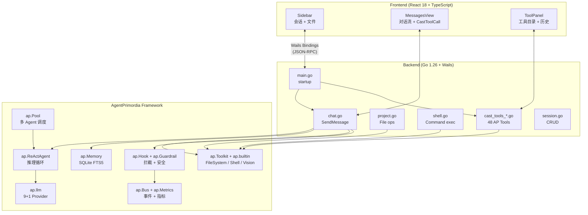
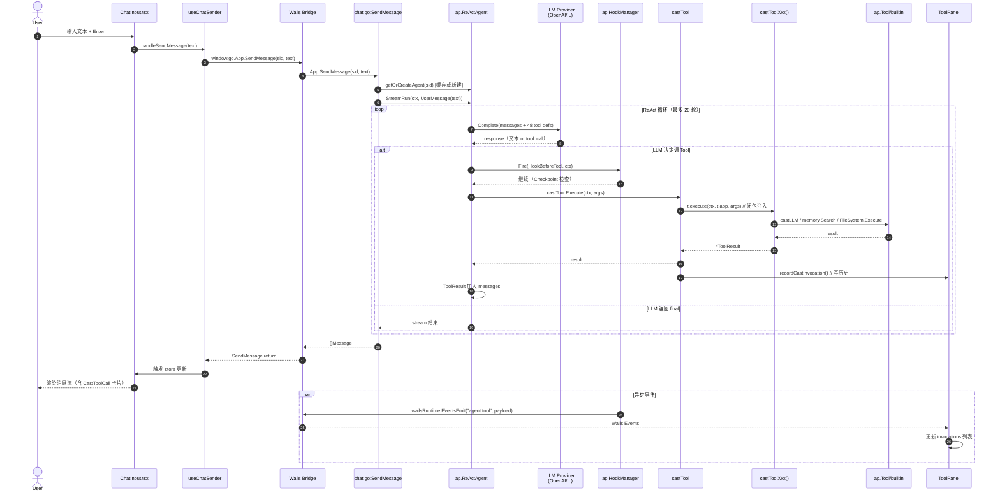
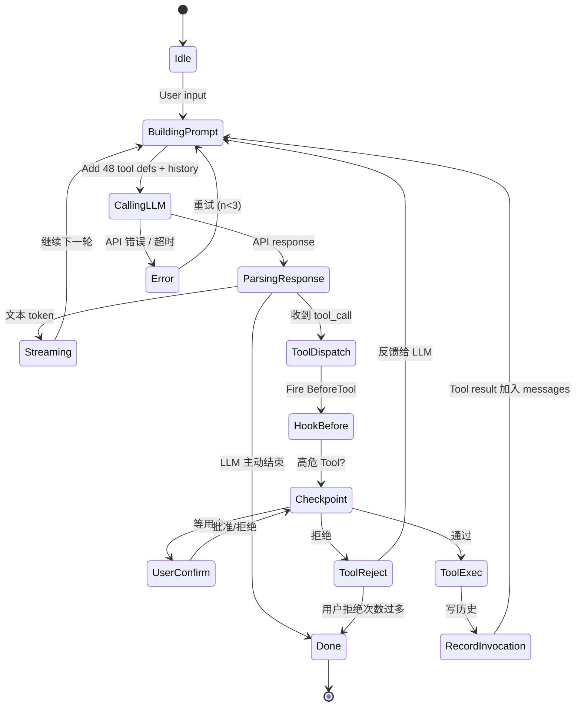
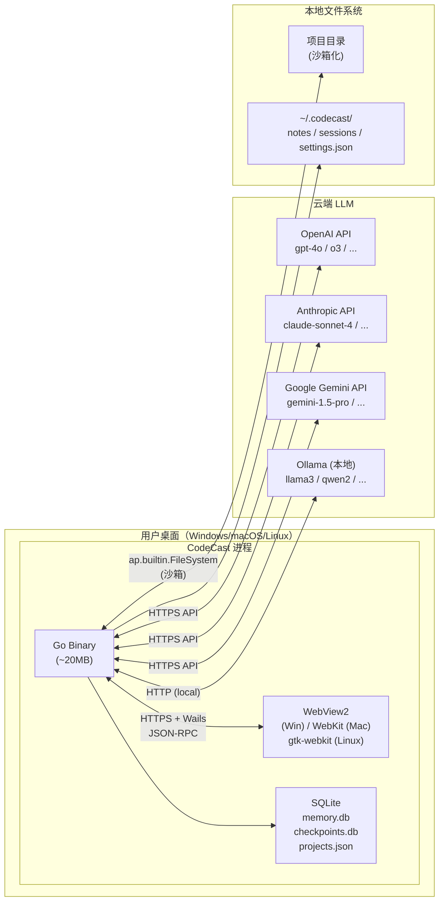
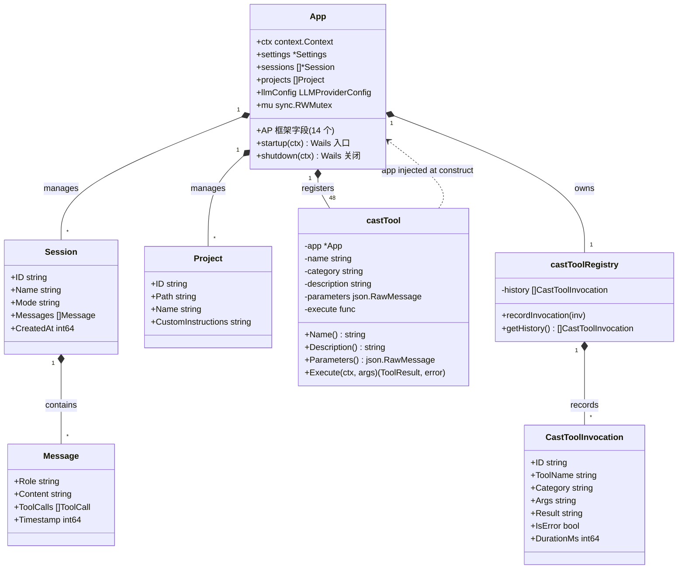
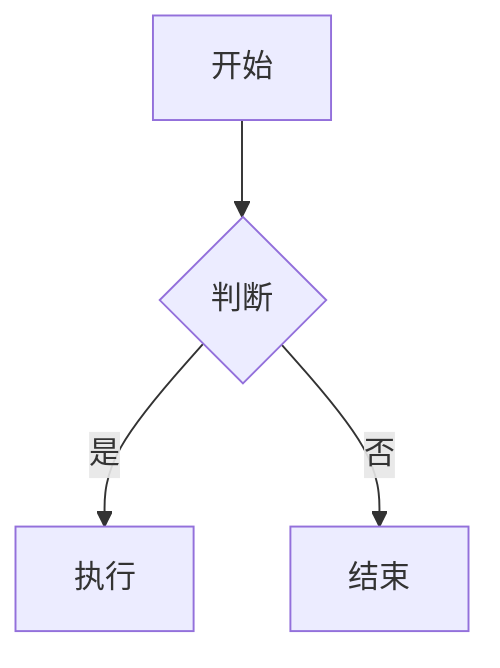

# CodeCast 代码 Wiki

> **CodeCast** 是基于 Wails (Go + Web) 的本地优先跨平台桌面 AI 编程助手，深度融合 AgentPrimordia (AP) 框架。
> 本 Wiki 提供完整的项目结构、模块职责、关键类/函数、依赖关系与运行方式说明。

---

## 目录

1. [项目总览](#1-项目总览)
2. [整体架构](#2-整体架构)
3. [后端模块](#3-后端模块)
4. [前端模块](#4-前端模块)
5. [AgentPrimordia 集成](#5-agentprimordia-集成)
6. [数据流](#6-数据流)
7. [关键类与函数](#7-关键类与函数)
8. [依赖关系](#8-依赖关系)
9. [运行与构建](#9-运行与构建)
10. [开发指南](#10-开发指南)

---

## 1. 项目总览

### 1.1 一句话定义

> CodeCast = Wails 桌面外壳 + AgentPrimordia Agent 框架 + 48 个 Cast AP Tool

### 1.2 关键数据

| 指标 | 数值 |
|------|------|
| 后端 Go 文件 | 49（核心 13000 行）|
| 前端源文件 | 128（.ts/.tsx）|
| Cast AP Tool | **48 个**（17 类别）|
| Wails 绑定方法 | ~110 个 |
| 前端 store slice | 18 个 |
| 直接外部依赖 | 4 个 Go（agentprimordia / wails / uuid / toast）+ 12 个 React |
| 开发语言 | Go 1.26 + TypeScript 5.4 + React 18.3 |

### 1.3 顶层目录结构

```
E:\codecast (2)\CodeCast\
├── CodeCast-desktop/         # 主桌面应用（Go 后端 + React 前端）
│   ├── *.go                  # 49 个后端文件
│   ├── frontend/             # React 前端
│   │   ├── src/
│   │   │   ├── App.tsx       # 主入口
│   │   │   ├── components/   # UI 组件
│   │   │   ├── store/        # Zustand slices
│   │   │   ├── hooks/        # React hooks
│   │   │   ├── types/        # TypeScript 类型
│   │   │   ├── styles/       # CSS
│   │   │   └── utils/        # 工具
│   │   ├── package.json
│   │   └── vite.config.ts
│   ├── go.mod                # 依赖
│   ├── wails.json
│   └── build/                # 编译输出
├── docs/                      # 项目文档
│   ├── AP_INTEGRATION.md     # AP 集成总结
│   └── specs/plans/           # 历史计划
├── README.md                  # 用户文档
├── AGENTS.md                  # Agent 协作规范
└── .gitee-ci.yml              # CI 配置
```

---

## 2. 整体架构

### 2.1 三层架构



**说明**：
- **Frontend**：3 栏布局，左侧 Sidebar/中间消息流/右侧 ToolPanel，通过 Wails Bindings 与后端通信
- **Backend**：Go 实现，49 个 .go 文件围绕 `App` struct 展开
- **AP Framework**：通过 go.mod `replace` 指令本地引用，提供所有 agent/memory/tool 能力

### 2.2 关键设计原则

1. **AP 框架作为底层**：所有 agent/memory/llm/tool 通过 `ap.*` 调用，CodeCast 不再维护自家实现
2. **单 App 单 Wails 绑定**：所有 Wails 绑定方法是 `App` 类型的方法
3. **工具通过 ToolRegistry 注册**：AI 在 ReAct 循环中自动选择调用
4. **3 栏 UI**：Sidebar（会话/文件）| Messages（消息流）| ToolPanel（工具目录+历史）
5. **Zustand slice 模式**：18 个状态切片，组合到 `useAppStore`

### 2.3 完整时序图（用户发送消息 → AI 调 Tool → 返回）



### 2.4 Cast Tool 生命周期（ER 图）

```mermaid
erDiagram
    App ||--o{ Session : "manages"
    App ||--o{ Project : "manages"
    App ||--||{ castToolRegistry : "owns"
    App ||--|| ap.Agent : "ReActAgent"
    App ||--|| ap.Toolkit : "registers 48 tools"
    App ||--|| ap.Memory : "episodes"
    App ||--|| ap.Bus : "events"

    castToolRegistry ||--o{ CastToolInvocation : "history[]"
    castToolRegistry ||--o{ castTool : "tools[]"

    castTool ||--|| ap.Tool : "implements"
    castTool ||--o| App : "app injected"
    castTool ||--|| castLLM : "calls for LLM tools"

    Session ||--o{ Message : "messages[]"
    Session ||--o{ Skill : "uses"

    Project ||--o{ Project : "nested paths"
    Project ||--o{ ap.FileSystem : "dispatchFS"

    Message ||--o{ CastToolCall : "embedded"
    CastToolCall }o--|| castTool : "displays"

    ap.Agent ||--|| ap.LLM : "Model"
    ap.Agent ||--|| ap.Toolkit : "tools"
    ap.Agent ||--|| ap.Memory : "episodes"
    ap.Agent ||--o{ ap.Hook : "fires"
```

---

## 3. 后端模块

### 3.1 文件清单（49 个 .go）

#### 3.1.1 核心入口（1 个）

| 文件 | 行数 | 职责 |
|------|------|------|
| `main.go` | 322 | Wails 启动入口、`App` struct 定义、startup 编排 |

#### 3.1.2 对话与 Agent（2 个）

| 文件 | 行数 | 职责 |
|------|------|------|
| `chat.go` | 129 | `SendMessage` / `SendMessageEx` / `getOrCreateAgent` |
| `checkpoint_hook.go` | 107 | Checkpoint 高危操作拦截（ap.HookBeforeTool） |

#### 3.1.3 会话与持久化（2 个）

| 文件 | 行数 | 职责 |
|------|------|------|
| `session.go` | 503 | 会话 CRUD（Get/Create/Delete/Search/Rename/Export）|
| `persistence.go` | ~180 | Session JSON 文件持久化 |

#### 3.1.4 项目与文件（2 个）

| 文件 | 行数 | 职责 |
|------|------|------|
| `project.go` | 314 | 项目管理 + 文件操作（转发 `ap.builtin.FileSystem`）|
| `shell.go` | 501 | Shell 命令执行（9 层安全 + 转发 `ap.builtin.Shell`）|

#### 3.1.5 Cast Tool 系统（21 个）

| 文件 | 行数 | 工具类别 | Tool 数 |
|------|------|---------|--------|
| `cast_tools.go` | 305 | 基类 + 注册 + 历史 | — |
| `cast_tools_types.go` | 395 | 48 个 Tool 的 args/result struct | — |
| `cast_tools_writing.go` | 146 | 写作 | 3 |
| `cast_tools_translation.go` | 91 | 翻译 | 2 |
| `cast_tools_kb.go` | 113 | 知识库 | 3 |
| `cast_tools_email.go` | 92 | 邮件 | 2 |
| `cast_tools_schedule.go` | 178 | 日程 | 3 |
| `cast_tools_todo.go` | 198 | 待办 + 番茄钟 | 5 |
| `cast_tools_misc.go` | 220 | 工具箱 | 6 |
| `cast_tools_plugin.go` | 138 | 插件 | 3 |
| `cast_tools_sandbox.go` | 76 | 沙箱 | 1 |
| `cast_tools_memory.go` | 79 | 记忆 | 2 |
| `cast_tools_perf.go` | 80 | 性能 | 2 |
| `cast_tools_learning.go` | 76 | 学习 | 2 |
| `cast_tools_security.go` | 92 | 安全 | 2 |
| `cast_tools_channel.go` | 136 | 通知 | 2 |
| `cast_tools_collab.go` | 84 | 协作 | 2 |
| `cast_tools_soul.go` | 80 | 人格 | 2 |
| `cast_tools_marketplace.go` | 90 | 市场 | 2 |
| `cast_tools_project.go` | 175 | 项目文件 | 4 |

**小计**：48 个 AP Tool，分布在 18 个类别文件（cast_tools.go + cast_tools_types.go + 18 个分类实现）

#### 3.1.6 配置 / 设置（2 个）

| 文件 | 行数 | 职责 |
|------|------|------|
| `config.go` | 866 | `Settings` struct、API 凭据解析（resolveCredentialsLocked）|
| `crypto.go` | — | API Key AES-256-GCM 加密 |

#### 3.1.7 LLM 抽象（2 个）

| 文件 | 行数 | 职责 |
|------|------|------|
| `provider_factory.go` | 157 | 9+1 LLM Provider 工厂（OpenAI/Anthropic/Gemini/Ollama/Azure/Cohere/Mistral + Qwen/GLM/DeepSeek）|
| `prompt_builder.go` | 162 | System prompt 构建（注入 48 个 Tool 目录）|

#### 3.1.8 AP 桥接（3 个）

| 文件 | 行数 | 职责 |
|------|------|------|
| `event_bridge.go` | 31 | `ap.Bus` → Wails Events 转发 |
| `cost_tracker.go` | 10 | 成本追踪 stub |
| `agent_bridge.go` | 99 | Pool Wails 绑定（DispatchAgents/GetAgents/CancelAgent）|

#### 3.1.9 浏览器 / 终端 / Git（3 个）

| 文件 | 行数 | 职责 |
|------|------|------|
| `browser.go` | — | 浏览器域名白名单管理 |
| `window.go` | 176 | Wails 窗口控制 |
| `git.go` | ~150 | Git 操作（status/commit/branch） |

#### 3.1.10 工具 / 辅助（5 个）

| 文件 | 职责 |
|------|------|
| `notification.go` | 通知中心（托盘/系统通知）|
| `i18n.go` | 多语言（zh-CN/en-US）|
| `security.go` | 加密 / 安全管理 |
| `metrics.go` | 性能指标 |
| `updater.go` | 自动更新 |
| `env_check.go` | 环境检查 |
| `prompts.go` | Prompt 文本（与 `prompt_builder.go` 配合）|
| `prompts_test.go` | Prompt 测试 |

#### 3.1.11 测试（3 个）

| 文件 | 职责 |
|------|------|
| `main_test.go` | 核心测试（NewApp / Settings / Session / Project / Checkpoint）|
| `session_test.go` | Session CRUD + buildSystemPrompt 测试 |
| `security_test.go` | 9 层安全检查测试 |
| `test_helpers_test.go` | 测试工具函数 |

### 3.2 后端模块依赖图

```
main.go
  ├── chat.go
  │     ├── prompt_builder.go → ap.PromptTemplate
  │     ├── provider_factory.go → ap.NewXxxProvider
  │     ├── event_bridge.go → ap.Bus.Subscribe
  │     ├── checkpoint_hook.go → ap.HookManager
  │     └── agent_bridge.go → ap.Pool
  ├── session.go
  │     ├── persistence.go
  │     └── prompts.go
  ├── project.go
  │     └── ap.builtin.FileSystem (转发)
  ├── shell.go
  │     └── ap.builtin.Shell (转发)
  ├── cast_tools.go
  │     ├── cast_tools_*.go (18 个 register 函数)
  │     └── cast_tools_types.go (args/result)
  ├── config.go → provider_factory.go
  ├── i18n.go / notification.go / security.go / metrics.go
  └── window.go / updater.go / env_check.go / git.go / browser.go
```

---

## 4. 前端模块

### 4.1 顶层结构（128 个 .ts/.tsx）

```
frontend/src/
├── main.tsx              # React 入口
├── App.tsx               # 根组件（3 栏布局）
├── api.ts                # Wails 绑定封装
├── settingsKeys.ts
│
├── components/           # UI 组件（37 个）
│   ├── ToolPanel/        # 右侧工具面板（4 个子组件）
│   │   ├── index.tsx     # Tab 切换 + 历史列表
│   │   ├── ToolList.tsx  # 工具目录（按类别）
│   │   ├── ToolHistory.tsx
│   │   └── EmptyState.tsx
│   ├── MessagesView/      # 消息流（1 个子组件）
│   │   └── CastToolCall.tsx  # Cast Tool 调用卡片
│   ├── InputArea/        # 输入区（10 个子组件）
│   ├── settings/         # 设置页
│   ├── __tests__/         # 组件测试
│   ├── Sidebar.tsx        # 会话 + 文件
│   ├── TopBar.tsx         # 顶部（已精简）
│   ├── MessagesView.tsx   # 消息流
│   ├── ChatInput.tsx      # 输入框
│   ├── ToolPanel/index.tsx
│   ├── FilesPanel.tsx
│   ├── PreviewPanel.tsx
│   ├── TitleBar.tsx
│   ├── WelcomeView.tsx
│   ├── CommandPalette.tsx
│   ├── SettingsPage.tsx   # 简化版
│   ├── NotificationCenter.tsx
│   └── ... (其他 UI 组件)
│
├── store/                # Zustand state
│   ├── index.ts          # useAppStore 组合入口
│   ├── storeTypes.ts     # SliceSet 类型
│   ├── types.ts          # 全局类型
│   ├── useSessionStore.ts
│   ├── useMessagesStore.ts
│   ├── useAgentStore.ts
│   ├── useModelStore.ts
│   ├── useUIStore.ts
│   ├── useToolsStore.ts   # Cast Tool 状态
│   ├── useProjectStore.ts
│   ├── useKnowledgeStore.ts
│   ├── useMemoryStore.ts
│   ├── useScheduleStore.ts
│   ├── useTodoStore.ts
│   ├── usePluginStore.ts
│   ├── usePerformanceStore.ts
│   ├── useAttachmentStore.ts
│   ├── useChangedFilesStore.ts
│   ├── useSlashCommandsStore.ts
│   ├── useMenuStore.ts
│   └── usePlatformStore.ts
│
├── hooks/                # React hooks（10 个）
│   ├── useChatSender.ts
│   ├── useAppInit.ts
│   ├── useSessionActions.ts
│   ├── useToolCall.ts     # 手动调 Cast Tool
│   ├── useKeyboardShortcuts.ts
│   ├── useAICompletion.ts
│   ├── useAutocomplete.ts
│   ├── useContextSelector.ts
│   ├── useSlashMenu.ts
│   └── useWindowSize.ts
│
├── types/                # TypeScript 类型
│   ├── agent.ts
│   ├── models.ts
│   ├── cast-*.ts          # Cast 特定类型
│
├── styles/               # CSS（11 个）
│   ├── index.css          # 主入口
│   ├── tool-panel.css     # 右侧面板
│   ├── layout.css / messages.css / ...
│
├── utils/                # 工具函数
│   ├── performance/
│   ├── rag/
│   ├── agent/
│   ├── WebVitalsMonitor.tsx
│   ├── ImageCache.ts / RetryHandler.ts / StorageEncryption.ts
│
├── tools/                # 前端 Tool 类型
│   └── types.ts          # 导出 SDK 的 ToolDefinition
│
├── plugins/              # 内置插件桩（保留兼容）
│   ├── index.ts
│   └── PluginTypes.ts
│
└── api/                  # Wails 绑定类型
    └── types.ts
```

### 4.2 3 栏布局（App.tsx）

```tsx
<div className="app">
  <TitleBar />
  <div className="app-body">
    <Sidebar />            {/* 左：会话 + 文件 */}
    <div className="main">
      <TopBar />
      <div className="chat-area">
        <MessagesView />    {/* 中：消息流 */}
      </div>
      <ChatInput />         {/* 中下：输入框 */}
      <ToolPanel />         {/* 右：工具面板 */}
    </div>
    <PreviewPanel />        {/* 右：预览 */}
    <FilesPanel />          {/* 右：文件树 */}
  </div>
  <NotificationCenter />
  <CommandPalette />
</div>
```

### 4.3 Zustand 18 个 Slice

| Slice | 文件 | 职责 |
|-------|------|------|
| Session | `useSessionStore.ts` | 会话列表、当前会话、CRUD |
| Project | `useProjectStore.ts` | 项目列表、当前项目 |
| UI | `useUIStore.ts` | 主题、面板显隐、侧边栏宽度 |
| Model | `useModelStore.ts` | LLM 模型、Provider 配置 |
| Attachment | `useAttachmentStore.ts` | 文件附件 |
| Todo | `useTodoStore.ts` | 待办列表 |
| ChangedFiles | `useChangedFilesStore.ts` | Git 变更 |
| SlashCommands | `useSlashCommandsStore.ts` | / 命令 |
| Menu | `useMenuStore.ts` | 菜单 |
| Platform | `usePlatformStore.ts` | 平台检测 |
| Messages | `useMessagesStore.ts` | 消息列表 |
| Agent | `useAgentStore.ts` | Agent 状态 |
| Performance | `usePerformanceStore.ts` | 性能指标 |
| Plugin | `usePluginStore.ts` | 插件状态 |
| Knowledge | `useKnowledgeStore.ts` | 知识库 |
| Memory | `useMemoryStore.ts` | 记忆 |
| Schedule | `useScheduleStore.ts` | 日程 |
| **Tools** | `useToolsStore.ts` | **Cast Tool 状态**（新增）|

---

## 5. AgentPrimordia 集成

### 5.1 集成度

| 维度 | 集成度 | 说明 |
|------|--------|------|
| LLM 抽象 | **100%** | 9+1 Provider 全走 `ap.llm` |
| Agent 引擎 | **100%** | `ap.NewReActAgent` |
| Memory | **100%** | `ap.NewSQLiteStore`（FTS5） |
| Tool Registry | **100%** | `ap.ToolRegistry` + 48 个 Cast Tool |
| Pool | **100%** | `ap.Pool` 替代 `task.go` |
| Hook | **100%** | `ap.HookManager` 实现 Checkpoint |
| Guardrail | **100%** | `ap.GuardrailEngine` PII/敏感词 |
| EventBus | **100%** | `ap.Bus` → Wails Events |
| CachedProvider | **100%** | 替代 `completor.go`（已删） |
| FileSystem | **100%** | `ap.builtin.FileSystem` 替代 `project.go` 文件操作 |
| Shell | **100%** | `ap.builtin.Shell` 替代 `exec.CommandContext` |
| Vision/OCR | **100%** | 真实多模态 API 调用 |
| 前端 SDK | **100%** | `@agentprimordia/sdk` 类型 |

### 5.2 App struct 的 AP 字段（main.go:30-62）

```go
type App struct {
    // AP 框架核心
    agent            ap.Agent                       // ReAct Agent
    pool             *ap.Pool                       // 多 Agent 调度
    memory           *ap.SQLiteStore                // 记忆存储
    ragStore         *ap.RAGStore                   // RAG 检索
    toolkit          *ap.ToolRegistry               // 48 个 Cast Tool
    castReg          *castToolRegistry              // 工具调用历史
    mcpReg           *ap.MCPRegistry                // MCP 服务器
    eventBus         *ap.Bus                        // 事件总线
    metricsCollector *ap.AgentMetricsCollector     // 指标
    guardrail        *ap.GuardrailEngine            // 安全护栏
    guardrailHook    *ap.GuardrailHook              // 护栏 Hook
    hooks            *ap.HookManager                // Hook 管理
    checkpointStore  ap.CheckpointStore             // 检查点
    lifecycle        *ap.Lifecycle                  // 生命周期
    sessionAgents    map[string]ap.Agent            // 每会话一个 Agent
    sessionCancels   map[string]context.CancelFunc  // 取消令牌
    checkpointConfirmations map[string]chan bool    // 用户确认

    // CodeCast 业务层（保留）
    sessions         []*Session
    skills           []*Skill
    projects         []Project
    llmConfig        LLMProviderConfig  // syncSettingsToConfig 依赖
}
```

### 5.3 48 个 Cast AP Tool 清单

| 类别 | 工具 | 数量 |
|------|------|------|
| writing | generate, polish, outline | 3 |
| translation | text, glossary | 2 |
| kb (知识库) | search, save, link | 3 |
| email | draft, send | 2 |
| schedule | create, list, run_now | 3 |
| todo | create, list, done, pomodoro_start, pomodoro_status | 5 |
| misc | brainstorm, meeting_minutes, ocr_image, password_gen, chart_generate, format_convert | 6 |
| plugin | list, install, exec | 3 |
| sandbox | run | 1 |
| memory | search, stats | 2 |
| perf | get_metrics, clear_cache | 2 |
| learning | get_patterns, clear | 2 |
| security | audit, blocked_history | 2 |
| channel | send, test | 2 |
| collab | share, invite | 2 |
| soul | set, list | 2 |
| marketplace | list, install | 2 |
| project | list_files, read_file, write_file, search | 4 |
| **小计** | | **48** |

---

## 6. 数据流

### 6.1 用户发送消息的完整流程

```
[1] 用户在 ChatInput 输入文本
    ↓
[2] useChatSender.handleSendMessage(text)
    ↓ (window.go.App.SendMessage)
[3] Wails JSON-RPC → 后端 App.SendMessage(sessionID, input)
    ↓
[4] chat.go: a.SendMessage()
    ├─ getOrCreateAgent(sessionID)  // 缓存或新建 ap.ReActAgent
    │  ├─ a.createProvider() → ap.NewOpenAIProvider(...)
    │  └─ ap.NewReActAgent(ReActConfig{
    │       Model: provider,
    │       Toolkit: a.toolkit,           // 48 个 Cast Tool
    │       Memory: ap.NewMemoryAdapter(a.memory),
    │       Hooks: a.hooks,               // Checkpoint Hook
    │       RAG: ...,
    │       MaxTurns: 20,
    │     })
    ├─ agent.StreamRun(ctx, ap.UserMessage(input))
    │  ↓
    │  [5] ap.ReActAgent.ReAct Loop:
    │     ├─ LLM.Complete(messages + tool definitions)
    │     │  ↓ 调 OpenAI/Anthropic/Gemini API
    │     │  ← 响应：可能是 tool_call
    │     ├─ 解析 tool_call
    │     ├─ 触发 ap.HookBeforeTool (Checkpoint 检查)
    │     │  ├─ 高危？→ 等用户确认
    │     │  └─ 通过 → 继续
    │     ├─ ap.Toolkit.Get(toolName).Execute(args)
    │     │  ↓ 转发到
    │     │  castTool.Execute(ctx, args)
    │     │  ├─ t.execute(ctx, t.app, args)
    │     │  │  ↓ 闭包注入
    │     │  │  a.castToolXxx(ctx, args)
    │     │  │  ↓ 业务实现
    │     │  │  ├─ a.castLLM(ctx, sys, user)  // 单轮 LLM
    │     │  │  ├─ a.memory.Search(ctx, query) // ap.Memory
    │     │  │  └─ dispatchFS(path, action, params) // ap.FileSystem
    │     │  ├─ 返回 *ap.ToolResult
    │     │  └─ a.recordCastInvocation(...) → ToolPanel 历史
    │     └─ 循环直到 LLM 返回 final 响应
    │
    ├─ 接收 stream: token / thought / tool_call / tool_result / done
    ├─ 通过 Wails Events 推送给前端
    │  ↓ (window.runtime.EventsOn)
    └─ 前端 MessagesView 实时显示
       - 文本流
       - 嵌入 CastToolCall 卡片（点击展开 args/result）
       - ToolPanel "调用历史" tab 实时追加
```

### 6.2 Cast Tool 调用细节

```
LLM 决定调用 cast_writing_generate(topic="周报", style="formal")
   ↓
ap.ReActAgent 解析 tool_call
   ↓
ap.HookManager.Fire(ap.HookBeforeTool, {ToolCall: {Name: "cast_writing_generate", ...}})
   ├─ checkpointHook 触发（cast_writing_generate 不在高危列表）
   └─ 通过
   ↓
ap.ToolRegistry.Get("cast_writing_generate").Execute(args)
   ↓
castTool.Execute(ctx, args)
   ├─ t.execute(ctx, t.app, args)
   │  ↓
   │  a.castToolWritingGenerate(ctx, args)
   │  ├─ json.Unmarshal → castWritingGenerateArgs
   │  ├─ a.castLLM(ctx, prompt, userPrompt)
   │  │  ├─ a.createProvider()  // 复用 chat 的 Provider
   │  │  └─ provider.Complete(req)
   │  │     ↓ HTTP → OpenAI / Anthropic API
   │  │     ← Content: "本周项目进展..."
   │  ├─ JSON 序列化结果
   │  └─ a.recordCastInvocation(
   │       "cast_writing_generate", "writing", sessionID,
   │       args, result, false, durationMs)
   │     └─ castReg.history = append(...)
   └─ return *ap.ToolResult{Content: result, IsError: false}
   ↓
ap.ReActAgent 接收 ToolResult，作为下一轮 LLM 输入
   ↓
最终 LLM 给出 final 响应
```

### 6.3 文件操作流程（写文件示例）

```
LLM 决定调用 cast_project_write_file(path="C:/proj", filePath="main.go", content="...")
   ↓
castTool → a.castToolProjectWriteFile(ctx, args)
   ├─ a.WriteFile(in.FilePath, in.Content)
   │  ↓
   │  dispatchFS(in.Path, "write", {path, content})
   │  ├─ getFileSystemFor(in.Path)
   │  │  ├─ ap.NewFileSystem(absPath)  // 缓存或新建
   │  │  └─ return ap.Tool
   │  └─ fs.Execute(ctx, argsJSON)
   │     └─ ap.builtin.FileSystem 内部：scope check → 写文件
   └─ a.recordCastInvocation("cast_project_write_file", ...)
```

### 6.4 ReAct Loop 状态机



**状态说明**：
- **Idle** → 等待用户输入
- **BuildingPrompt** → 构造 messages + 48 tool definitions
- **CallingLLM** → HTTP 请求到 LLM Provider
- **ParsingResponse** → 解析 LLM 输出（文本 / tool_call / 结束标记）
- **ToolDispatch** → 调 HookBefore 检查后执行
- **Checkpoint** → 高危 Tool（write_file/run_command）需要用户确认
- **RecordInvocation** → 写 castToolRegistry.history

### 6.5 部署架构



**安全特性**：
- 所有 LLM 通信走 HTTPS（OpenAI/Anthropic/Gemini）
- 文件操作通过 `ap.builtin.FileSystem` 沙箱（路径白名单 + 大小限制）
- Shell 命令走 9 层 CodeCast 安全规则 + AP Shell 白名单（深度防御）
- API Key 用 AES-256-GCM 加密存储在 `~/.codecast/`

---

## 7. 关键类与函数

### 7.1 后端：App struct (main.go:30-85)

**字段分组**：
- 上下文与配置：ctx, config, settings, settingsPath, encryptionKey
- 业务数据：sessions, skills, projects, currentProjectID, noProjectMode
- AP 框架：agent, pool, memory, ragStore, toolkit, castReg, mcpReg, eventBus, metricsCollector, guardrail, hooks, checkpointStore, lifecycle, sessionAgents, sessionCancels, checkpointConfirmations
- 应用层：llmConfig, completor（已删）, notes（已删）
- 并发：mu (sync.RWMutex), activeSessionID, memoryCleanupStop, taskSchedulerStop（已删）, migrationPending

#### App struct 类图



---

### 7.2 核心方法清单

#### main.go
```go
func (a *App) startup(ctx context.Context)         // Wails 启动入口
func (a *App) domReady(ctx context.Context)        // DOM ready
func (a *App) shutdown(ctx context.Context)         // Wails 关闭
func (a *App) onFileDrop(x, y int, paths []string) // 文件拖放
```

#### chat.go
```go
func (a *App) SendMessage(sessionID, input string) ([]Message, error)
func (a *App) SendMessageEx(sessionID, input, model, thinking string) ([]Message, error)
func (a *App) getOrCreateAgent(sessionID string, model string) (ap.Agent, context.CancelFunc, error)
func (a *App) CancelRequest()
func (a *App) CancelSessionRequest(sessionID string)
```

#### session.go
```go
func (a *App) GetSessions() []*Session
func (a *App) CreateSession(name, skillID, mode string) *Session
func (a *App) GetSession(id string) *Session
func (a *App) DeleteSession(id string) error
func (a *App) SearchSessions(keyword string) []*Session
func (a *App) ExportSession(id, format string) (string, error)
func (a *App) RenameSession(id, newName string) error
func (a *App) GetSkills() []*Skill
func (a *App) CreateSkill(name, description, prompt string) (*Skill, error)
```

#### project.go
```go
func (a *App) GetProjects() []Project
func (a *App) AddProject(path string) (Project, error)
func (a *App) RemoveProject(path string) error
func (a *App) SetCurrentProject(id string)
func (a *App) GetCurrentProject() *Project
func (a *App) ListFiles(path string) ([]string, error)        // 转发 ap.FileSystem
func (a *App) ReadFile(path string) (string, error)          // 转发 ap.FileSystem
func (a *App) WriteFile(path, content string) error          // 转发 ap.FileSystem
func (a *App) SelectFile() (string, error)                   // Wails Dialog
func (a *App) SelectFolder() (string, error)
```

#### shell.go
```go
func (a *App) ExecuteCommand(command string, timeoutSeconds int) (string, error)
func (a *App) getCustomEnvVars() []string
```

#### agent_bridge.go (Pool 绑定)
```go
func (a *App) DispatchAgents(tasksJSON string) ([]string, error)
func (a *App) GetAgents(sessionID string) []AgentInfo
func (a *App) GetAgentDetail(agentID string) *AgentInfo
func (a *App) CancelAgent(agentID string) error
func (a *App) CancelSessionAgents(sessionID string) error
```

#### Cast Tool 注册（cast_tools.go）
```go
type castTool struct {
    app         *App
    name        string
    category    string
    description string
    parameters  json.RawMessage
    execute     func(ctx, *App, args) (*ap.ToolResult, error)
}

func newCastTool(app *App, name, category, description string, parameters json.RawMessage, fn) *castTool
func toolToApTools(tools []*castTool) []ap.Tool

func (a *App) RegisterCastTools(toolkit *ap.ToolRegistry) error
func (a *App) recordCastInvocation(toolName, category, sessionID, args, result string, isError bool, durationMs int64) *ap.ToolResult
func (a *App) castLLM(ctx, systemPrompt, userPrompt string) (string, error)
func (a *App) InvokeCastTool(name, argsJSON string) (string, error)  // Wails 绑定
func (a *App) GetToolCatalog() []ToolCatalogItem
func (a *App) GetToolHistory(sessionID string, limit int) []CastToolInvocation
```

#### 后端 Helper 函数
```go
func generateID(prefix string) string                      // "cast_20260101_xxxx"
func orDefault(s, d string) string                         // 字符串默认值
func nowMs() int64                                         // 当前毫秒
func parseNumberedList(text string) []string               // 解析 LLM 编号输出
func truncate(s string, n int) string                      // 截断
func isAllDigit(s string) bool
```

### 7.3 前端：关键组件

#### useAppStore (store/index.ts)
```typescript
export interface AppState extends SessionSlice, ProjectSlice, UISlice, ...  // 15 slice
export const useAppStore = create<AppState>(...)                          // Zustand store
```

#### useChatSender (hooks/useChatSender.ts)
```typescript
export function useChatSender(): { handleSendMessage: (text: string) => Promise<void> }
```

#### useToolCall (hooks/useToolCall.ts)
```typescript
export const useToolCall = (opts: { toolName: string; category: string }) => {
  call: (args: Record<string, any>) => Promise<ToolCallResponse & { durationMs: number }>
  loading: boolean
  error: string | null
}
```

#### ToolPanel/index.tsx
- 3 栏布局右侧
- Tab 切换：🧰 工具目录 / 📜 调用历史
- 显示统计（成功/失败计数）

#### CastToolCall.tsx (MessagesView 子组件)
- 折叠态：单行 chip（icon + 工具名 + 耗时）
- 展开态：tab 切换"参数 / 结果(错误)" + 复制按钮

### 7.4 AP 框架 SDK (TypeScript)

```typescript
// E:\codecast (2)\agentprimordia\agentprimordia\sdk\typescript\src\index.ts
export interface ToolDefinition { name, description, parameters, execute }
export interface ToolCallRequest { toolName, args }
export interface ToolCallResponse { result, usage }
export interface LLMProvider { complete, stream, callTools, embeddings, info }
export interface ReActConfig { name, systemPrompt, model, tools? }
export class ReActAgent { constructor(config) }
export class Pool { constructor(config) }
```

---

## 8. 依赖关系

### 8.1 Go 依赖（go.mod）

**直接依赖**：
| 库 | 用途 |
|------|------|
| `agentprimordia` v0.0.0 | Agent 框架（local replace 指向 ../../agentprimordia）|
| `github.com/wailsapp/wails/v2` v2.12.0 | 桌面应用框架 |
| `github.com/google/uuid` v1.6.0 | UUID 生成 |
| `git.sr.ht/~jackmordaunt/go-toast/v2` v2.0.3 | Windows 通知 |

**间接依赖**：Wails 拉取 WebView2 / Win32 / Linux GTK / macOS Cocoa 等平台绑定

**AP 框架通过 go.mod replace 引入**：
```go
replace agentprimordia => ../../agentprimordia/agentprimordia
```

### 8.2 TypeScript 依赖（package.json）

**生产依赖**：
| 库 | 用途 |
|------|------|
| `@agentprimordia/sdk` | AP 框架 TS SDK（file: link）|
| `react` 18.3.1 | UI 框架 |
| `react-dom` 18.3.1 | DOM 渲染 |
| `zustand` 4.5.0 | 状态管理 |
| `@tanstack/react-virtual` | 虚拟滚动 |
| `highlight.js` | 代码高亮 |
| `marked` | Markdown 解析 |
| `katex` | LaTeX 公式 |
| `mermaid` | 图表渲染 |
| `dompurify` | HTML 净化 |
| `@sentry/react` | 错误监控 |

**开发依赖**：
- Vite 5.x（构建）
- TypeScript 5.4
- Vitest（测试）
- Playwright（E2E）
- ESLint + Prettier

### 8.3 依赖图

```
CodeCast-desktop (Go)
  │
  ├─→ wails v2.12.0
  │     └─→ WebView2 / GTK / Cocoa (平台相关)
  │
  └─→ agentprimordia (replace → E:\codecast (2)\agentprimordia\agentprimordia)
        ├─→ internal/agent
        ├─→ internal/llm (OpenAI/Anthropic/Gemini/Ollama/...)
        ├─→ internal/memory (SQLite FTS5)
        ├─→ internal/tools (Tool 注册)
        ├─→ internal/builtin (FileSystem/Shell/Knowledge)
        ├─→ internal/pool (并发调度)
        ├─→ internal/security (ACL/Sandbox/Guardrail)
        └─→ sdk/typescript (TypeScript SDK)

frontend (TypeScript)
  │
  ├─→ react 18.3.1
  ├─→ zustand 4.5.0
  ├─→ @tanstack/react-virtual
  ├─→ @agentprimordia/sdk (file: link)
  └─→ wails 自动生成的 bindings (frontend/wailsjs/)
```

---

## 9. 运行与构建

### 9.1 环境要求

- **Go 1.26+**
- **Node.js 20+**
- **Wails CLI**：`go install github.com/wailsapp/wails/v2/cmd/wails@latest`
- **Windows 10+** / **macOS 11+** / **Linux**（GTK 3+）

### 9.2 开发模式

```bash
# 1. 启动后端热重载 + 前端 dev server
cd E:\codecast (2)\CodeCast\CodeCast-desktop
wails dev

# 2. 仅启动前端（需后端单独跑）
cd E:\codecast (2)\CodeCast\CodeCast-desktop\frontend
npm run dev
```

### 9.3 生产构建

```bash
# Windows
wails build -platform windows/amd64

# macOS Apple Silicon
wails build -platform darwin/arm64

# macOS Intel
wails build -platform darwin/amd64

# 输出位置
build/bin/CodeCast.exe (或 .app / 可执行文件)
```

### 9.4 仅前端构建

```bash
cd frontend
npm run build       # 输出到 dist/
npm run test        # 跑 Vitest
npx tsc --noEmit    # 仅类型检查
```

### 9.5 跳过前端打包（开发后端）

```bash
wails build -s
# -s 跳过前端 npm 操作，直接构建 Go 二进制
```

### 9.6 验证编译

```bash
go build ./...                    # 后端编译
go test -count=1 ./...           # 后端测试
cd frontend && npx tsc --noEmit  # 前端类型检查
cd frontend && npm test          # 前端测试
```

### 9.7 AP 框架依赖

- `E:\codecast (2)\agentprimordia\agentprimordia` 必须存在
- go.mod 中 `replace` 指令：`replace agentprimordia => ../../agentprimordia/agentprimordia`
- SDK 需先 `npm run build` 生成 dist/（已包含在 `node_modules/@agentprimordia/sdk`）

---

## 10. 开发指南

### 10.1 如何新增一个 Cast Tool

#### 步骤 1：在 cast_tools_types.go 定义 args/result

```go
// 写入
type castFooArgs struct {
    Name string `json:"name"`
}
type castFooResult struct {
    ID string `json:"id"`
}
```

#### 步骤 2：在合适分类文件实现

选已有 `cast_tools_xxx.go` 或新建 `cast_tools_foo.go`：

```go
// cast_tools_foo.go
package main

func registerFooTools(a *App, toolkit *ap.ToolRegistry) error {
    tools := []*castTool{
        newCastTool(a, "cast_foo_create", "foo",
            "创建 foo 资源",
            json.RawMessage(`{"type":"object","properties":{"name":{"type":"string"}},"required":["name"]}`),
            func(ctx context.Context, a *App, args json.RawMessage) (*ap.ToolResult, error) {
                return a.castToolFooCreate(ctx, args)
            },
        ),
    }
    return toolkit.RegisterMultiple(toolToApTools(tools)...)
}

func (a *App) castToolFooCreate(ctx context.Context, args json.RawMessage) (*ap.ToolResult, error) {
    var in castFooArgs
    if err := json.Unmarshal(args, &in); err != nil {
        return &ap.ToolResult{Content: "invalid args: " + err.Error(), IsError: true}, nil
    }
    // 业务实现
    out := castFooResult{ID: "foo_123"}
    outJSON, _ := json.Marshal(out)
    return a.recordCastInvocation("cast_foo_create", "foo", "", args, string(outJSON), false, 0), nil
}
```

#### 步骤 3：在 cast_tools.go 注册到列表

```go
for _, r := range []func(*App, *ap.ToolRegistry) error{
    registerWritingTools, ...
    registerFooTools,  // ← 加这行
}{
    r(a, toolkit)
}
```

#### 步骤 4：编译 + 测试

```bash
go build ./... && go test -count=1 ./...
```

### 10.2 如何新增一个前端 Slice

```typescript
// store/useXxxStore.ts
export interface XxxSlice {
  items: Item[];
  addItem: (i: Item) => void;
}

export const createXxxSlice = (set: SliceSet): XxxSlice => ({
  items: [],
  addItem: (i) => set((state) => ({ items: [...state.items, i] })),
});
```

```typescript
// store/index.ts
import { createXxxSlice } from './useXxxStore';
export interface AppState extends ...XxxSlice {
  isStreaming: boolean;
}
const store = {
  ...createXxxSlice(sliceSet),
  // ...
};
```

### 10.3 如何新增一个 Wails 绑定

后端：在 `App` 上加 `func (a *App) YourMethod(...) (...)`（大写开头）
前端：Wails 自动生成 `frontend/wailsjs/go/main/App.d.ts`，可直接 `import { YourMethod } from '.../App'`

### 10.4 如何新增一个 AP Tool 到 chat 主循环

48 个 Cast Tool **自动**被 LLM 看到（通过 prompt_builder.go 注入到 system prompt）。
只需要按 10.1 步骤加到 `cast_tools.go` 注册列表即可。

### 10.5 调试技巧

```bash
# 后端日志（slog）
export AP_LOG_LEVEL=debug

# 前端 devtools
# 应用启动后按 F12 打开

# 启用 Checkpoint（高危操作需要确认）
# 默认开启：app.hooks.Register(ap.HookBeforeTool, a.checkpointHook)
# 在 chat.go startup 阶段

# 测试单个 Tool
go test -run TestChat -v ./...
```

### 10.6 关键文件导航

| 想做什么 | 看哪个文件 |
|----------|-----------|
| 加新的 LLM provider | `provider_factory.go` |
| 改 chat 行为 | `chat.go` + `prompt_builder.go` |
| 加新 Cast Tool | `cast_tools_types.go` + `cast_tools_*.go` |
| 改 Wails 绑定 | 加新方法到 `*.go` 的 `App` 上 |
| 改 UI 布局 | `App.tsx` + `styles/` |
| 改 store | `store/index.ts` + 15 个 `useXxxStore.ts` |
| 改 AP 调用 | 看 `ap.*` 类型在 `E:\codecast (2)\agentprimordia\agentprimordia\pkg\` |

---

## 附录 A：48 个 Cast Tool 详细参数

| Tool 名 | 类别 | Args | Result |
|--------|------|------|--------|
| `cast_writing_generate` | writing | `docType, topic, style, length, outline` | `{title, content}` |
| `cast_writing_polish` | writing | `text, action, style` | `{content}` |
| `cast_writing_outline` | writing | `topic, sections` | `{outline:[]}` |
| `cast_translate_text` | translation | `text, target, style` | `{original, target, content}` |
| `cast_translate_glossary` | translation | `term, trans` | 持久化术语 |
| `cast_kb_search` | kb | `query, limit` | `{hits:[]}` |
| `cast_kb_save` | kb | `title, content, tags` | `{id}` |
| `cast_kb_link` | kb | `from, to` | — |
| `cast_email_draft` | email | `to, subject, body, tone` | `{subject, body}` |
| `cast_email_send` | email | `to, subject, body` | — |
| `cast_schedule_create` | schedule | `name, description, schedule, command` | `{id}` |
| `cast_schedule_list` | schedule | `limit` | `{tasks:[]}` |
| `cast_schedule_run_now` | schedule | `taskId` | `{started, message}` |
| `cast_todo_create` | todo | `title, priority, dueDate, recurring` | `{id}` |
| `cast_todo_list` | todo | `includeDone` | `[]castTodoItem` |
| `cast_todo_done` | todo | `id` | — |
| `cast_pomodoro_start` | todo | `minutes` | `{startedAt, minutes}` |
| `cast_pomodoro_status` | todo | — | `{active, ...}` |
| `cast_brainstorm` | misc | `topic, count` | `{ideas:[]}` |
| `cast_meeting_minutes` | misc | `transcript` | `{summary, actionItems, decisions}` |
| `cast_ocr_image` | misc | `imagePath, prompt, lang, model, maxTokens` | `{text, lang, model, usage}` |
| `cast_password_gen` | misc | `length, symbols` | `{password}` |
| `cast_chart_generate` | misc | `description, format` | `{code}` |
| `cast_format_convert` | misc | `from, to, input` | `{output}` |
| `cast_plugin_list` | plugin | `source` | `{plugins:[]}` |
| `cast_plugin_install` | plugin | `pluginId` | `{installed, message}` |
| `cast_plugin_exec` | plugin | `pluginId, command, args` | `{output}` |
| `cast_sandbox_run` | sandbox | `lang, code, stdin` | `{stdout, stderr, exitCode, duration}` |
| `cast_memory_search` | memory | `query, limit` | `{episodes:[]}` |
| `cast_memory_stats` | memory | — | `{totalEpisodes, ...}` |
| `cast_perf_get_metrics` | perf | — | `{fps, memoryMB, ...}` |
| `cast_perf_clear_cache` | perf | `cache` | `{cleared}` |
| `cast_learning_get_patterns` | learning | `limit` | `{patterns:[]}` |
| `cast_learning_clear` | learning | — | — |
| `cast_security_audit` | security | `range` | `{threatsBlocked, ...}` |
| `cast_security_blocked_history` | security | `limit` | `{events:[]}` |
| `cast_channel_send` | channel | `channel, target, title, content, extra` | `{sent, message}` |
| `cast_channel_test` | channel | `channel, target` | `{ok}` |
| `cast_collab_share` | collab | `sessionId, peer, mode` | `{link}` |
| `cast_collab_invite` | collab | `email, message` | — |
| `cast_soul_set` | soul | `persona` | `{active}` |
| `cast_soul_list` | soul | — | `{personas:[]}` |
| `cast_marketplace_list` | marketplace | `category, query` | `{items:[]}` |
| `cast_marketplace_install` | marketplace | `itemId` | `{installed, message}` |
| `cast_project_list_files` | project | `path, recursive` | 文件列表 |
| `cast_project_read_file` | project | `path, filePath` | 文件内容 |
| `cast_project_write_file` | project | `path, filePath, content` | — |
| `cast_project_search` | project | `path, pattern` | 匹配文件列表 |

---

## 附录 B：相关文档

- [README.md](README.md) — 用户面向的产品介绍
- [AGENTS.md](AGENTS.md) — Agent 协作规范
- [docs/AP_INTEGRATION.md](docs/AP_INTEGRATION.md) — AP 框架深度融合总结
- [docs/specs/](docs/specs/) — 历史设计与计划
- AP 框架源码：`E:\codecast (2)\agentprimordia\`

---

## 附录 C：图示索引

本 Wiki 共包含 **5 类 Mermaid 图**：

| 图类型 | 位置 | 内容 |
|--------|------|------|
| **flowchart** (组件) | §2.1 | 三层架构：Frontend / Backend / AP |
| **sequenceDiagram** (时序) | §2.3 | 完整 chat 流程：用户输入 → AI 调 Tool → 返回 |
| **erDiagram** (实体) | §2.4 | 数据模型：App/Session/Project/castTool/Registry |
| **stateDiagram-v2** (状态) | §6.4 | ReAct Loop 状态机：Idle → CallingLLM → ToolExec → Done |
| **flowchart** (部署) | §6.5 | 部署架构：桌面进程 + LLM API + 本地文件 |
| **classDiagram** (类图) | §7.1 后 | App struct + Session + castTool 关系 |

### 渲染说明

所有 Mermaid 图在以下环境自动渲染：
- **GitHub**：自动渲染
- **VS Code**：需装 "Markdown Preview Mermaid Support" 扩展
- **Typora / Obsidian / MarkText**：自动渲染
- **GitLab / Notion**：自动渲染
- **本地查看**：`npx -y @mermaid-js/mermaid-cli -i docs/CODE_WIKI.md -o wiki.pdf`

### Mermaid 速查



完整语法参考 [Mermaid 官方文档](https://mermaid.js.org/syntax/flowchart.html)。

---

**最后更新**：2026-06-04
**维护者**：CodeCast 团队
**CodeCast 版本**：v1.0+ (post-AP-integration)
